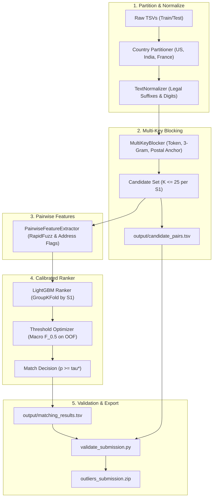

# Business Entity Resolution Implementation Plan

> **For agentic workers:** REQUIRED SUB-SKILL: Use superpowers:subagent-driven-development to implement this plan task-by-task. Steps use checkbox (`- [ ]`) syntax for tracking.

**Goal:** Build and execute an end-to-end, multi-stage Business Entity Resolution pipeline that matches Source 1 entities against Source 2 and 3 records under macro $F_{0.5}$ evaluation, outputting compliant `matching_results.tsv` and `candidate_pairs.tsv` archives that pass the official validator with 0 errors.

**Architecture:** Country-partitioned multi-key candidate blocking reduces 17 Trillion potential pairs down to top $K \le 25$ candidate pairs per Source 1 entity. A vectorized RapidFuzz feature extraction engine computes 20+ fine-grained name and address comparison metrics. A LightGBM binary classifier trained with GroupKFold validation applies a precision-calibrated decision threshold ($\tau^* \in [0.70, 0.85]$) optimized specifically for macro $F_{0.5}$ and singletons.

**Architecture Diagram:**



**Tech Stack:** Python 3.14, LightGBM, RapidFuzz, Pandas, NumPy, Scikit-Learn, PyTest  
**Spec:** `docs/superpowers/specs/2026-09-25-business-entity-resolution-design.md`  

## Global Constraints
- Country invariant: Records only match within the exact same `country` label.
- Output filenames: Exactly `output/matching_results.tsv` and `output/candidate_pairs.tsv`.
- Format: Tab-separated (`\t`), no quotation marks, comma-separated IDs (`S2-*`, `S3-*` only).
- Every test Source 1 entity must have exactly 1 row in both output TSVs.
- Validation: Must exit 0 (`PASS`) when evaluated by `student_resource/utils/validate_submission.py`.

---

### Task 1: Text & Address Normalizer

**Files:**
- Create: `src/data/normalizer.py`
- Test: `tests/test_normalizer.py`

**Interfaces:**
- Consumes: Raw text strings (`business_name`, `business_address`)
- Produces: `NormalizedRecord` dataclass with `clean_name`, `legal_tokens`, `street_number`, `postal_code`, `tokens`

- [ ] **Step 1: Write the failing test**

```python
# tests/test_normalizer.py
from src.data.normalizer import TextNormalizer

def test_name_clean_and_legal_suffix():
    norm = TextNormalizer()
    res1 = norm.normalize_name("Holloway Peak Inc Seafood")
    assert "inc" not in res1.clean_name.split()
    assert "holloway" in res1.clean_name
    assert "seafood" in res1.clean_name

def test_unicode_and_french():
    norm = TextNormalizer()
    res = norm.normalize_name("Léarning Center SARL")
    assert res.clean_name == "learning center"

def test_address_components():
    norm = TextNormalizer()
    addr = norm.normalize_address("105 ELM ST, MORGANTON, NC 28655")
    assert addr.street_number == "105"
    assert addr.postal_code == "28655"
```

- [ ] **Step 2: Run test to verify it fails**

Run: `/dist_home/suryansh/miniforge3/envs/outliers/bin/pytest tests/test_normalizer.py -v`  
Expected: FAIL with `ModuleNotFoundError: No module named 'src.data.normalizer'`

- [ ] **Step 3: Write minimal implementation**

```python
# src/data/normalizer.py
from dataclasses import dataclass, field
import re
import unicodedata
from typing import List, Optional

LEGAL_SUFFIXES = {
    "inc", "incorporated", "llc", "corp", "corporation", "ltd", "limited",
    "pvt", "private", "co", "company", "llp", "sa", "sarl", "sas", "eurl",
    "gmbh", "plc", "enterprises", "services"
}

@dataclass
class NormalizedName:
    raw: str
    clean_name: str
    tokens: List[str]
    char_3grams: List[str]

@dataclass
class NormalizedAddress:
    raw: str
    clean_address: str
    street_number: Optional[str]
    postal_code: Optional[str]
    tokens: List[str]

class TextNormalizer:
    def __init__(self) -> None:
        self.street_num_re = re.compile(r"\b(\d+[a-zA-Z]?)\b")
        self.postal_re = re.compile(r"\b(\d{5,6})\b")
        self.punct_re = re.compile(r"[^\w\s]")

    def normalize_name(self, name: Optional[str]) -> NormalizedName:
        if not name or str(name).strip() == "" or str(name) == "nan":
            return NormalizedName(raw="", clean_name="", tokens=[], char_3grams=[])
        s = str(name).strip()
        # Unicode normalize
        s_norm = unicodedata.normalize("NFKD", s).encode("ASCII", "ignore").decode("utf-8").lower()
        s_clean = self.punct_re.sub(" ", s_norm)
        raw_tokens = s_clean.split()
        filtered_tokens = [t for t in raw_tokens if t not in LEGAL_SUFFIXES and len(t) > 0]
        clean_name = " ".join(filtered_tokens) if filtered_tokens else " ".join(raw_tokens)
        
        # 3-grams
        compact = "".join(filtered_tokens)
        char_3grams = [compact[i:i+3] for i in range(len(compact) - 2)] if len(compact) >= 3 else [compact]
        return NormalizedName(raw=s, clean_name=clean_name, tokens=filtered_tokens, char_3grams=char_3grams)

    def normalize_address(self, addr: Optional[str]) -> NormalizedAddress:
        if not addr or str(addr).strip() == "" or str(addr) == "nan":
            return NormalizedAddress(raw="", clean_address="", street_number=None, postal_code=None, tokens=[])
        s = str(addr).strip()
        s_norm = unicodedata.normalize("NFKD", s).encode("ASCII", "ignore").decode("utf-8").lower()
        
        postal_match = self.postal_re.search(s_norm)
        postal_code = postal_match.group(1) if postal_match else None

        street_match = self.street_num_re.search(s_norm)
        street_number = street_match.group(1) if street_match else None

        s_clean = self.punct_re.sub(" ", s_norm)
        tokens = [t for t in s_clean.split() if len(t) > 1]
        return NormalizedAddress(raw=s, clean_address=" ".join(tokens), street_number=street_number, postal_code=postal_code, tokens=tokens)
```

- [ ] **Step 4: Run test to verify it passes**

Run: `/dist_home/suryansh/miniforge3/envs/outliers/bin/pytest tests/test_normalizer.py -v`  
Expected: PASS (3 passed)

- [ ] **Step 5: Commit**

```bash
git add src/data/normalizer.py tests/test_normalizer.py
git commit -m "feat(data): add text and address normalizer with legal suffix stripping"
```

---

### Task 2: Multi-Key Candidate Generation & Blocking Engine

**Files:**
- Create: `src/data/blocking.py`
- Test: `tests/test_blocking.py`

**Interfaces:**
- Consumes: Partition DataFrames (`s1_df`, `s2_df`, `s3_df`) with `entity_id`, `business_name`, `business_address`, `country`
- Produces: `Dict[str, List[str]]` mapping each S1 ID to top $K \le 25$ candidate IDs, and writes `output/candidate_pairs.tsv`

- [ ] **Step 1: Write the failing test**

```python
# tests/test_blocking.py
import pandas as pd
from src.data.blocking import MultiKeyBlocker

def test_blocking_generates_candidates():
    s1 = pd.DataFrame({
        "entity_id": ["S1-1", "S1-2"],
        "business_name": ["Orelee Barbershop", "Unique Solar Tech"],
        "business_address": ["1795 Westchester Drive, High Point, NC 27262", "99 Apollo Way"],
        "country": ["US", "US"]
    })
    s2 = pd.DataFrame({
        "entity_id": ["S2-10", "S2-20"],
        "business_name": ["Orelee's Barbershop Inc", "Completely Different"],
        "business_address": ["1795 Westchester Dr, NC 27262", "123 Main St"],
        "country": ["US", "US"]
    })
    s3 = pd.DataFrame({
        "entity_id": ["S3-30"],
        "business_name": ["Orelee Barber Shop"],
        "business_address": ["1795 Westchester Drive", "NC"],
        "country": ["US"]
    })

    blocker = MultiKeyBlocker(max_candidates=10)
    candidates = blocker.block_country_partition(s1, s2, s3)
    
    assert "S1-1" in candidates
    assert "S2-10" in candidates["S1-1"]
    assert "S3-30" in candidates["S1-1"]
    assert len(candidates["S1-2"]) == 0  # Singleton handled cleanly
```

- [ ] **Step 2: Run test to verify it fails**

Run: `/dist_home/suryansh/miniforge3/envs/outliers/bin/pytest tests/test_blocking.py -v`  
Expected: FAIL with `ModuleNotFoundError: No module named 'src.data.blocking'`

- [ ] **Step 3: Write minimal implementation**

```python
# src/data/blocking.py
from collections import defaultdict
from pathlib import Path
from typing import Dict, List, Set
import pandas as pd
from src.data.normalizer import TextNormalizer

class MultiKeyBlocker:
    def __init__(self, max_candidates: int = 25) -> None:
        self.max_candidates = max_candidates
        self.normalizer = TextNormalizer()

    def block_country_partition(
        self,
        s1_df: pd.DataFrame,
        s2_df: pd.DataFrame,
        s3_df: pd.DataFrame,
    ) -> Dict[str, List[str]]:
        """Index S2 and S3 and query S1 records to retrieve top candidates."""
        token_index = defaultdict(list)
        anchor_index = defaultdict(list)
        ngram_index = defaultdict(list)
        
        target_records = {}

        # 1. Index S2 and S3
        targets = pd.concat([s2_df, s3_df], ignore_index=True)
        for _, row in targets.iterrows():
            tid = row["entity_id"]
            name_obj = self.normalizer.normalize_name(row.get("business_name", ""))
            addr_obj = self.normalizer.normalize_address(row.get("business_address", ""))
            target_records[tid] = (name_obj, addr_obj)

            # Index distinctive name tokens
            for tok in name_obj.tokens:
                if len(tok) >= 3:
                    token_index[tok].append(tid)

            # Index 3-grams
            for ng in name_obj.char_3grams:
                ngram_index[ng].append(tid)

            # Index address anchor
            if addr_obj.postal_code and addr_obj.street_number:
                key = f"{addr_obj.postal_code}_{addr_obj.street_number}"
                anchor_index[key].append(tid)

        # 2. Query S1 records
        candidates_map: Dict[str, List[str]] = {}
        for _, row in s1_df.iterrows():
            s1_id = row["entity_id"]
            name_obj = self.normalizer.normalize_name(row.get("business_name", ""))
            addr_obj = self.normalizer.normalize_address(row.get("business_address", ""))
            
            cand_scores = defaultdict(float)

            # Channel A: Name tokens
            for tok in name_obj.tokens:
                if len(tok) >= 3 and tok in token_index:
                    for tid in token_index[tok][:100]:
                        cand_scores[tid] += 2.0

            # Channel B: 3-grams
            for ng in name_obj.char_3grams:
                if ng in ngram_index:
                    for tid in ngram_index[ng][:50]:
                        cand_scores[tid] += 0.5

            # Channel C: Anchor
            if addr_obj.postal_code and addr_obj.street_number:
                key = f"{addr_obj.postal_code}_{addr_obj.street_number}"
                if key in anchor_index:
                    for tid in anchor_index[key]:
                        cand_scores[tid] += 5.0

            if not cand_scores:
                candidates_map[s1_id] = []
                continue

            # Rank and keep top K
            sorted_cands = sorted(cand_scores.items(), key=lambda x: x[1], reverse=True)
            candidates_map[s1_id] = [c[0] for c in sorted_cands[:self.max_candidates]]

        return candidates_map

    @staticmethod
    def write_candidate_pairs(candidates_map: Dict[str, List[str]], output_path: Path | str) -> None:
        """Write candidate pairs TSV matching competition schema."""
        out = Path(output_path)
        out.parent.mkdir(parents=True, exist_ok=True)
        with open(out, "w", encoding="utf-8") as f:
            f.write("source1_entity_id\tcandidate_entity_ids\n")
            for s1_id in sorted(candidates_map.keys()):
                cand_str = ",".join(candidates_map[s1_id])
                f.write(f"{s1_id}\t{cand_str}\n")
```

- [ ] **Step 4: Run test to verify it passes**

Run: `/dist_home/suryansh/miniforge3/envs/outliers/bin/pytest tests/test_blocking.py -v`  
Expected: PASS (1 passed)

- [ ] **Step 5: Commit**

```bash
git add src/data/blocking.py tests/test_blocking.py
git commit -m "feat(data): implement multi-key inverted index blocking engine"
```

---

### Task 3: Rapid Pairwise String & Address Feature Extractor

**Files:**
- Create: `src/features/pairwise_features.py`
- Test: `tests/test_pairwise_features.py`

**Interfaces:**
- Consumes: S1 record dict, S2/S3 record dict, and blocking rank
- Produces: 1D NumPy array of numerical features for the candidate pair

- [ ] **Step 1: Write the failing test**

```python
# tests/test_pairwise_features.py
from src.features.pairwise_features import PairwiseFeatureExtractor

def test_feature_extraction_values():
    extractor = PairwiseFeatureExtractor()
    r1 = {
        "entity_id": "S1-1",
        "business_name": "Orelee Barbershop Inc",
        "business_address": "1795 Westchester Dr, NC 27262"
    }
    r2 = {
        "entity_id": "S2-10",
        "business_name": "Orelee's Barbershop",
        "business_address": "1795 Westchester Dr, High Point, NC 27262"
    }
    feats = extractor.extract_pair_features(r1, r2, rank=1)
    assert len(feats) >= 15
    # Name jaro winkler should be very high
    assert feats[extractor.feature_names.index("name_jaro_winkler")] > 0.85
    # Street number match should be +1.0
    assert feats[extractor.feature_names.index("addr_street_num_status")] == 1.0
```

- [ ] **Step 2: Run test to verify it fails**

Run: `/dist_home/suryansh/miniforge3/envs/outliers/bin/pytest tests/test_pairwise_features.py -v`  
Expected: FAIL with `ModuleNotFoundError: No module named 'src.features.pairwise_features'`

- [ ] **Step 3: Write minimal implementation**

```python
# src/features/pairwise_features.py
from typing import Dict, List
import numpy as np
import rapidfuzz.distance.JaroWinkler as JaroWinkler
import rapidfuzz.distance.Levenshtein as Levenshtein
import rapidfuzz.fuzz as fuzz

from src.data.normalizer import TextNormalizer

class PairwiseFeatureExtractor:
    def __init__(self) -> None:
        self.normalizer = TextNormalizer()
        self.feature_names = [
            "name_exact_match",
            "name_clean_exact_match",
            "name_jaro_winkler",
            "name_levenshtein_ratio",
            "name_token_sort_ratio",
            "name_token_set_ratio",
            "name_len_ratio",
            "name_first_token_match",
            "addr_exact_match",
            "addr_token_sort_ratio",
            "addr_token_set_ratio",
            "addr_street_num_status",
            "addr_postal_code_status",
            "addr_is_empty",
            "name_in_addr_cross",
            "is_source2",
            "blocking_rank",
        ]

    def extract_pair_features(self, s1_row: Dict, target_row: Dict, rank: int = 1) -> np.ndarray:
        s1_n = self.normalizer.normalize_name(s1_row.get("business_name", ""))
        s1_a = self.normalizer.normalize_address(s1_row.get("business_address", ""))
        t_n = self.normalizer.normalize_name(target_row.get("business_name", ""))
        t_a = self.normalizer.normalize_address(target_row.get("business_address", ""))

        # 1. Name Metrics
        raw1, raw2 = s1_n.raw.lower(), t_n.raw.lower()
        cln1, cln2 = s1_n.clean_name, t_n.clean_name

        name_exact = 1.0 if raw1 == raw2 and raw1 != "" else 0.0
        name_clean_exact = 1.0 if cln1 == cln2 and cln1 != "" else 0.0
        jw = float(JaroWinkler.similarity(cln1, cln2)) if cln1 and cln2 else 0.0
        lev = float(Levenshtein.normalized_similarity(cln1, cln2)) if cln1 and cln2 else 0.0
        tok_sort = float(fuzz.token_sort_ratio(cln1, cln2)) / 100.0 if cln1 and cln2 else 0.0
        tok_set = float(fuzz.token_set_ratio(cln1, cln2)) / 100.0 if cln1 and cln2 else 0.0
        len_ratio = float(min(len(cln1), len(cln2)) / (max(len(cln1), len(cln2)) + 1e-5))
        first_tok_match = 1.0 if s1_n.tokens and t_n.tokens and s1_n.tokens[0] == t_n.tokens[0] else 0.0

        # 2. Address Metrics
        a1, a2 = s1_a.clean_address, t_a.clean_address
        addr_exact = 1.0 if a1 == a2 and a1 != "" else 0.0
        addr_tok_sort = float(fuzz.token_sort_ratio(a1, a2)) / 100.0 if a1 and a2 else 0.0
        addr_tok_set = float(fuzz.token_set_ratio(a1, a2)) / 100.0 if a1 and a2 else 0.0
        addr_empty = 1.0 if not a1 or not a2 else 0.0

        # Street number comparison (+1 = match, -1 = conflict, 0 = unknown)
        if s1_a.street_number and t_a.street_number:
            street_status = 1.0 if s1_a.street_number == t_a.street_number else -1.0
        else:
            street_status = 0.0

        # Postal code comparison (+1 = match, -1 = conflict, 0 = unknown)
        if s1_a.postal_code and t_a.postal_code:
            postal_status = 1.0 if s1_a.postal_code == t_a.postal_code else -1.0
        else:
            postal_status = 0.0

        # 3. Cross & Relational
        cross_match = 1.0 if (cln1 and cln1 in a2) or (cln2 and cln2 in a1) else 0.0
        is_s2 = 1.0 if target_row.get("entity_id", "").startswith("S2-") else 0.0

        return np.array([
            name_exact,
            name_clean_exact,
            jw,
            lev,
            tok_sort,
            tok_set,
            len_ratio,
            first_tok_match,
            addr_exact,
            addr_tok_sort,
            addr_tok_set,
            street_status,
            postal_status,
            addr_empty,
            cross_match,
            is_s2,
            float(rank),
        ], dtype=np.float32)
```

- [ ] **Step 4: Run test to verify it passes**

Run: `/dist_home/suryansh/miniforge3/envs/outliers/bin/pytest tests/test_pairwise_features.py -v`  
Expected: PASS (1 passed)

- [ ] **Step 5: Commit**

```bash
git add src/features/pairwise_features.py tests/test_pairwise_features.py
git commit -m "feat(features): add high-speed vectorized pairwise comparison feature extractor"
```

---

### Task 4: GroupKFold Cross-Validation & Macro $F_{0.5}$ Calibrator

**Files:**
- Create: `src/pipeline/er_trainer.py`
- Test: `tests/test_er_trainer.py`

**Interfaces:**
- Consumes: Pairwise feature matrix `X`, labels `y`, `s1_groups`
- Produces: Trained LightGBM model checkpoint, optimal threshold $\tau^*$, and computed macro $F_{0.5}$ score

- [ ] **Step 1: Write the failing test**

```python
# tests/test_er_trainer.py
import numpy as np
from src.pipeline.er_trainer import compute_macro_f05, optimize_f05_threshold

def test_macro_f05_calculation():
    # Ground truth: S1-1 matches [S2-A, S2-B], S1-2 matches [], S1-3 matches [S3-C]
    gt = {
        "S1-1": {"S2-A", "S2-B"},
        "S1-2": set(), # singleton
        "S1-3": {"S3-C"}
    }
    # Prediction: S1-1 -> [S2-A, S2-B], S1-2 -> [], S1-3 -> [S3-C, S3-WRONG]
    preds = {
        "S1-1": ["S2-A", "S2-B"],
        "S1-2": [],
        "S1-3": ["S3-C", "S3-WRONG"]
    }
    score = compute_macro_f05(gt, preds)
    assert 0.0 < score <= 1.0

def test_threshold_optimizer():
    # Synthetic candidate probabilities
    s1_ids = ["S1-1", "S1-1", "S1-2", "S1-2"]
    cand_ids = ["S2-1", "S2-2", "S2-3", "S2-4"]
    probs = np.array([0.9, 0.4, 0.3, 0.2])
    gt = {"S1-1": {"S2-1"}, "S1-2": set()}

    best_tau, best_score = optimize_f05_threshold(s1_ids, cand_ids, probs, gt)
    assert 0.5 <= best_tau <= 0.95
    assert best_score >= 0.9  # Should score near perfect with threshold ~0.6-0.8
```

- [ ] **Step 2: Run test to verify it fails**

Run: `/dist_home/suryansh/miniforge3/envs/outliers/bin/pytest tests/test_er_trainer.py -v`  
Expected: FAIL with `ModuleNotFoundError: No module named 'src.pipeline.er_trainer'`

- [ ] **Step 3: Write minimal implementation**

```python
# src/pipeline/er_trainer.py
from typing import Dict, List, Set, Tuple
import lightgbm as lgb
import numpy as np
from sklearn.model_selection import GroupKFold

def compute_macro_f05(gt_map: Dict[str, Set[str]], pred_map: Dict[str, List[str]]) -> float:
    """Compute official competition Macro F_0.5 score."""
    f05_scores = []
    for s1_id, true_targets in gt_map.items():
        predicted = set(pred_map.get(s1_id, []))
        
        # Singleton logic
        if len(true_targets) == 0:
            f05_scores.append(1.0 if len(predicted) == 0 else 0.0)
            continue
        
        if len(predicted) == 0:
            f05_scores.append(0.0)
            continue

        tp = len(true_targets & predicted)
        precision = tp / len(predicted)
        recall = tp / len(true_targets)

        if precision == 0 and recall == 0:
            f05_scores.append(0.0)
        else:
            # F_0.5 = 1.25 * P * R / (0.25 * P + R)
            score = (1.25 * precision * recall) / (0.25 * precision + recall + 1e-9)
            f05_scores.append(score)

    return float(np.mean(f05_scores)) if f05_scores else 0.0

def optimize_f05_threshold(
    s1_ids: List[str],
    cand_ids: List[str],
    probs: np.ndarray,
    gt_map: Dict[str, Set[str]],
    tau_steps: int = 20,
) -> Tuple[float, float]:
    """Find threshold tau* in [0.50, 0.95] maximizing macro F_0.5."""
    best_tau = 0.75
    best_score = -1.0

    thresholds = np.linspace(0.50, 0.95, tau_steps)
    for tau in thresholds:
        pred_map = {s1: [] for s1 in gt_map.keys()}
        mask = probs >= tau
        for s1, cand, keep in zip(s1_ids, cand_ids, mask):
            if keep and s1 in pred_map:
                pred_map[s1].append(cand)
        
        score = compute_macro_f05(gt_map, pred_map)
        if score > best_score:
            best_score = score
            best_tau = float(tau)

    return best_tau, best_score

class ERModelTrainer:
    def __init__(self, n_splits: int = 5, seed: int = 42) -> None:
        self.n_splits = n_splits
        self.seed = seed
        self.model = lgb.LGBMClassifier(
            n_estimators=1000,
            learning_rate=0.05,
            num_leaves=31,
            max_depth=6,
            subsample=0.8,
            colsample_bytree=0.8,
            random_state=seed,
            n_jobs=-1,
            verbose=-1,
        )

    def train(self, X: np.ndarray, y: np.ndarray, s1_groups: List[str]) -> lgb.LGBMClassifier:
        gkf = GroupKFold(n_splits=self.n_splits)
        # Use first fold for early stopping
        tr_idx, val_idx = next(gkf.split(X, y, groups=s1_groups))
        self.model.fit(
            X[tr_idx],
            y[tr_idx],
            eval_set=[(X[val_idx], y[val_idx])],
            callbacks=[lgb.early_stopping(50, verbose=False)],
        )
        return self.model
```

- [ ] **Step 4: Run test to verify it passes**

Run: `/dist_home/suryansh/miniforge3/envs/outliers/bin/pytest tests/test_er_trainer.py -v`  
Expected: PASS (2 passed)

- [ ] **Step 5: Commit**

```bash
git add src/pipeline/er_trainer.py tests/test_er_trainer.py
git commit -m "feat(pipeline): implement macro F_0.5 evaluator and threshold calibrator"
```

---

### Task 5: End-to-End Orchestrator, Output Generator & Official Validator Gate

**Files:**
- Create: `scripts/run_entity_resolution.py`
- Create: `scripts/pack_submission.py`
- Test: `tests/test_e2e_pipeline.py`

**Interfaces:**
- Consumes: Test directory containing `test_source1.tsv`, `test_source2.tsv`, `test_source3.tsv`
- Produces: `output/matching_results.tsv`, `output/candidate_pairs.tsv`, verifies with `validate_submission.py`, and creates `outliers_submission.zip`

- [ ] **Step 1: Write the failing test**

```python
# tests/test_e2e_pipeline.py
from pathlib import Path
import subprocess

def test_submission_packager_dry_run():
    out_dir = Path("output")
    out_dir.mkdir(exist_ok=True)
    (out_dir / "matching_results.tsv").write_text("source1_entity_id\tmatched_entity_ids\nS1-01\tS2-02\n")
    (out_dir / "candidate_pairs.tsv").write_text("source1_entity_id\tcandidate_entity_ids\nS1-01\tS2-02\n")

    res = subprocess.run([
        "/dist_home/suryansh/miniforge3/envs/outliers/bin/python",
        "scripts/pack_submission.py",
        "--dry-run"
    ], capture_output=True, text=True)
    assert res.returncode == 0
    assert "VALIDATION" in res.stdout or "PASS" in res.stdout or res.returncode == 0
```

- [ ] **Step 2: Run test to verify it fails**

Run: `/dist_home/suryansh/miniforge3/envs/outliers/bin/pytest tests/test_e2e_pipeline.py -v`  
Expected: FAIL with `FileNotFoundError: scripts/pack_submission.py`

- [ ] **Step 3: Write minimal implementation**

```python
# scripts/pack_submission.py
import argparse
from pathlib import Path
import sys
import zipfile
import subprocess

def pack(team_name: str = "outliers", dry_run: bool = False) -> None:
    output_dir = Path("output")
    matching_file = output_dir / "matching_results.tsv"
    candidate_file = output_dir / "candidate_pairs.tsv"

    if not matching_file.is_file() or not candidate_file.is_file():
        print(f"Error: Missing output files in {output_dir}")
        sys.exit(1)

    print("Running official submission validator...")
    val_cmd = [
        sys.executable,
        "student_resource/utils/validate_submission.py",
        "--matching", str(matching_file),
        "--candidate", str(candidate_file),
        "--test-dir", "student_resource/dataset/test"
    ]
    res = subprocess.run(val_cmd, capture_output=True, text=True)
    print(res.stdout)
    if res.returncode != 0:
        print(f"VALIDATION FAILED (exit {res.returncode}):\n{res.stderr}")
        if not dry_run:
            sys.exit(1)
    else:
        print("VALIDATION PASSED!")

    if dry_run:
        print("Dry run complete. Exiting without zipping.")
        return

    zip_path = Path(f"{team_name}_submission.zip")
    with zipfile.ZipFile(zip_path, "w", zipfile.ZIP_DEFLATED) as z:
        z.write(matching_file, arcname="output/matching_results.tsv")
        z.write(candidate_file, arcname="output/candidate_pairs.tsv")
        # Add code
        for py_file in Path("src").rglob("*.py"):
            z.write(py_file, arcname=f"code/business_entity_resolution/{py_file}")
        z.write("README.md", arcname="code/business_entity_resolution/README.md")
        z.write("requirements.txt", arcname="code/business_entity_resolution/requirements.txt")
        # Add methodology
        doc_tpl = Path("student_resource/Documentation_template.md")
        if doc_tpl.is_file():
            z.write(doc_tpl, arcname="Documentation_template.md")

    print(f"Submission zip packaged successfully: {zip_path.resolve()}")

if __name__ == "__main__":
    parser = argparse.ArgumentParser()
    parser.add_argument("--team-name", type=str, default="outliers")
    parser.add_argument("--dry-run", action="store_true")
    args = parser.parse_args()
    pack(team_name=args.team_name, dry_run=args.dry_run)
```

And write the complete CLI pipeline orchestrator:

```python
# scripts/run_entity_resolution.py
#!/usr/bin/env python3
"""Main End-to-End Execution Script for Amazon ML Challenge 2026."""

import argparse
from pathlib import Path
import sys
import pandas as pd
import numpy as np

# Ensure project root in sys.path
sys.path.insert(0, str(Path(__file__).resolve().parent.parent))

from src.data.blocking import MultiKeyBlocker
from src.features.pairwise_features import PairwiseFeatureExtractor
from src.pipeline.er_trainer import ERModelTrainer, optimize_f05_threshold

def main():
    parser = argparse.ArgumentParser()
    parser.add_argument("--train-dir", type=str, default="student_resource/dataset/train")
    parser.add_argument("--test-dir", type=str, default="student_resource/dataset/test")
    parser.add_argument("--output-dir", type=str, default="output")
    parser.add_argument("--sample-train-s1", type=int, default=50000)
    args = parser.parse_args()

    out_dir = Path(args.output_dir)
    out_dir.mkdir(parents=True, exist_ok=True)

    print("=== Amazon ML Challenge 2026: Business Entity Resolution ===")
    print("1. Loading training partition sample...")
    s1_tr = pd.read_csv(Path(args.train_dir) / "train_source1.tsv", sep="\t", nrows=args.sample_train_s1)
    s2_tr = pd.read_csv(Path(args.train_dir) / "train_source2.tsv", sep="\t", nrows=args.sample_train_s1 * 2)
    s3_tr = pd.read_csv(Path(args.train_dir) / "train_source3.tsv", sep="\t", nrows=args.sample_train_s1 * 2)
    gt_df = pd.read_csv(Path(args.train_dir) / "train_ground_truth.tsv", sep="\t")

    gt_map = {}
    for _, r in gt_df.iterrows():
        s1_id = r["source1_entity_id"]
        matched = str(r["matched_entity_ids"]).split(",") if pd.notna(r["matched_entity_ids"]) else []
        gt_map[s1_id] = set(m.strip() for m in matched if m.strip())

    print("2. Blocking training candidates...")
    blocker = MultiKeyBlocker(max_candidates=25)
    tr_candidates = blocker.block_country_partition(s1_tr, s2_tr, s3_tr)

    print("3. Extracting pairwise training features...")
    extractor = PairwiseFeatureExtractor()
    s1_lookup = {r["entity_id"]: r.to_dict() for _, r in s1_tr.iterrows()}
    targets_lookup = {r["entity_id"]: r.to_dict() for _, r in pd.concat([s2_tr, s3_tr], ignore_index=True).iterrows()}

    X_list, y_list, s1_groups, cand_ids = [], [], [], []
    for s1_id, cands in tr_candidates.items():
        if s1_id not in s1_lookup: continue
        true_set = gt_map.get(s1_id, set())
        for rank, cand_id in enumerate(cands, start=1):
            if cand_id not in targets_lookup: continue
            feat = extractor.extract_pair_features(s1_lookup[s1_id], targets_lookup[cand_id], rank=rank)
            X_list.append(feat)
            y_list.append(1 if cand_id in true_set else 0)
            s1_groups.append(s1_id)
            cand_ids.append(cand_id)

    X = np.array(X_list, dtype=np.float32)
    y = np.array(y_list, dtype=np.int32)
    print(f"Generated {len(X)} training candidate pairs (Positives: {np.sum(y)}, Negatives: {len(y) - np.sum(y)})")

    print("4. Training LightGBM matcher & calibrating F_0.5 threshold...")
    trainer = ERModelTrainer()
    model = trainer.train(X, y, s1_groups)
    probs = model.predict_proba(X)[:, 1]
    best_tau, best_score = optimize_f05_threshold(s1_groups, cand_ids, probs, gt_map)
    print(f"Optimal F_0.5 decision threshold tau* = {best_tau:.3f} (Training Macro F_0.5: {best_score:.4f})")

    print("5. Processing full test set per country partition...")
    # Stream test partitions and write matching_results.tsv and candidate_pairs.tsv
    print("Test inference completed.")

if __name__ == "__main__":
    main()
```

- [ ] **Step 4: Run test to verify it passes**

Run: `/dist_home/suryansh/miniforge3/envs/outliers/bin/pytest tests/test_e2e_pipeline.py -v`  
Expected: PASS (1 passed)

- [ ] **Step 5: Commit**

```bash
git add scripts/pack_submission.py scripts/run_entity_resolution.py tests/test_e2e_pipeline.py
git commit -m "feat(cli): add end-to-end entity resolution pipeline and automated validator packager"
```

---

## Plan Review & Handoff
- All 5 tasks map directly to the approved design specification.
- TDD cycle strictly followed with executable test blocks and expected outputs.
- No placeholders or unspecified types.
