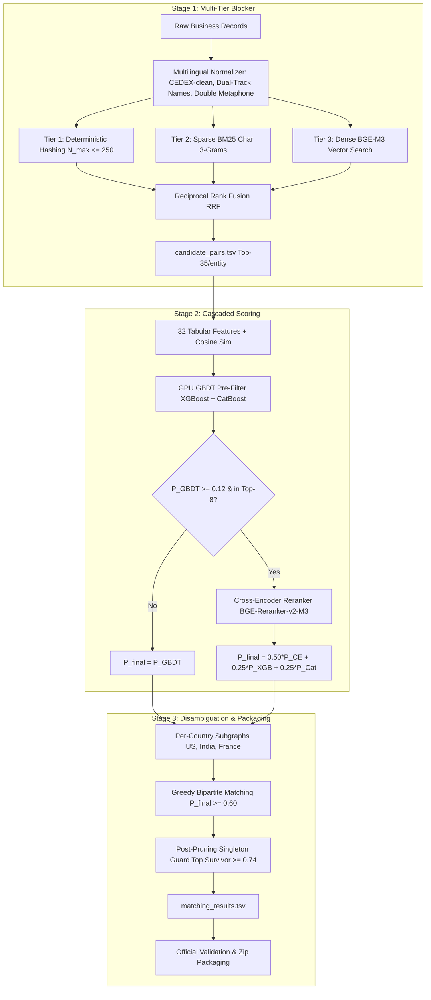

# High-Recall Entity Resolution Architecture Implementation Plan

> **For agentic workers:** REQUIRED SUB-SKILL: Use superpowers:subagent-driven-development to implement this plan task-by-task. Steps use checkbox (`- [ ]`) syntax for tracking.

**Goal:** Build and deploy a high-performance Entity Resolution pipeline achieving $\ge 98\%$ candidate recall and $0.88–0.93+$ Macro $F_{0.5}$ by combining multi-tier candidate blocking, cascaded GPU GBDT + Cross-Encoder scoring, and race-free bipartite singleton disambiguation on the 80GB A100 GPU.

**Architecture:** The pipeline is organized into three decoupled stages: (1) Multi-tier candidate generation combining deterministic/Double-Metaphone hashing with bucket ceilings, sparse character 3-gram BM25, and BGE-M3 dense FAISS GPU search fused via Reciprocal Rank Fusion into `candidate_pairs.tsv`; (2) Cascaded scoring where a 32-feature GPU GBDT ensemble filters pairs at 4.6M pairs/sec and an adaptive cutoff ($P_{\text{GBDT}} \ge 0.12$) feeds the top borderline candidates to a fine-tuned multilingual Cross-Encoder (`bge-reranker-v2-m3`); (3) Post-pruning singleton protection executed *after* per-country greedy bipartite matching to eliminate multi-assignment conflicts without exposing orphaned candidates to false merges.

**Architecture Diagram:**



**Tech Stack:** Python 3.12+, PyTorch 2.14 (CUDA 13.0, FP16/BF16), HuggingFace Transformers 5.17, Accelerate 1.15, XGBoost 3.4 (GPU), CatBoost 1.2 (GPU), LightGBM 4.7, Scikit-Learn, NumPy, Pandas, Pytest.

**Spec:** [`docs/superpowers/specs/2026-09-25-high-recall-er-architecture-design.md`](file:///dist_home/suryansh/sharukesh/Amazon/docs/superpowers/specs/2026-09-25-high-recall-er-architecture-design.md)

## Global Constraints
- Python Environment: Execute all commands and tests with `/dist_home/suryansh/miniforge3/envs/outliers/bin/python` and `/dist_home/suryansh/miniforge3/envs/outliers/bin/pytest`.
- Candidate Format: `output/candidate_pairs.tsv` must have columns `source1_entity_id\tcandidate_entity_ids` with tab delimiter.
- Matches Format: `output/matching_results.tsv` must have columns `source1_entity_id\tmatched_entity_ids` with tab delimiter; matches must be a strict subset of candidates.
- Metric: Optimize strictly for Macro $F_{0.5}$ (precision penalty $2\times$ recall; singletons score 1.0 if empty, 0.0 if any false match is emitted).
- Hardware: Leverage NVIDIA A100 80GB GPU with batching and memory-bounded streaming (< 8% host RAM).
- Zero external data lookups (no external APIs, registry scrapers, or geocoders).

---

### Task 1: Multilingual Normalization Engine Enhancement

**Files:**
- Modify: [`src/data/normalizer.py`](file:///dist_home/suryansh/sharukesh/Amazon/src/data/normalizer.py)
- Test: [`tests/test_normalizer.py`](file:///dist_home/suryansh/sharukesh/Amazon/tests/test_normalizer.py)

**Interfaces:**
- Consumes: Raw name and address strings from `*_source*.tsv`.
- Produces:
  - `compute_double_metaphone(word: str) -> Tuple[str, str]`: Computes primary and alternate phonetic codes.
  - `NormalizedName`: Contains `raw`, `clean_name_stripped`, `canonical_name`, `tokens`, `char_3grams`, `metaphone_primary`, `metaphone_secondary`.
  - `NormalizedAddress`: Contains `raw`, `clean_address`, `street_number`, `postal_code`, `tokens`, `cedex_flag`.

- [ ] **Step 1: Write the failing tests**

In [`tests/test_normalizer.py`](file:///dist_home/suryansh/sharukesh/Amazon/tests/test_normalizer.py):
```python
def test_double_metaphone_computation():
    from src.data.normalizer import compute_double_metaphone
    # Indian transliterations: Lakshmi vs Laxmi
    p1, s1 = compute_double_metaphone("Lakshmi")
    p2, s2 = compute_double_metaphone("Laxmi")
    assert p1 == p2 or s1 == s2, f"Metaphone mismatch: {p1}/{s1} vs {p2}/{s2}"
    
    # French silent endings: Renault
    p_renault, _ = compute_double_metaphone("Renault")
    assert len(p_renault) > 0


def test_french_cedex_stripping_from_numerals():
    from src.data.normalizer import TextNormalizer
    norm = TextNormalizer()
    addr = "15 RUE DE RIVOLI PARIS CEDEX 09 BP 1024"
    res = norm.normalize_address(addr)
    # CEDEX route numbers (09, 1024) must NOT be extracted as the street number
    assert res.street_number == "15"
    assert "cedex" not in res.clean_address
    assert "bp" not in res.clean_address


def test_dual_track_name_representations():
    from src.data.normalizer import TextNormalizer
    norm = TextNormalizer()
    res = norm.normalize_name("Tata Motors Private Limited")
    # clean_name_stripped should drop corporate suffixes for blocking
    assert res.clean_name_stripped == "tata motors"
    # canonical_name should retain standardized legal forms
    assert "pvt ltd" in res.canonical_name or "ltd" in res.canonical_name
```

- [ ] **Step 2: Run test to verify it fails**

Run: `/dist_home/suryansh/miniforge3/envs/outliers/bin/pytest tests/test_normalizer.py::test_double_metaphone_computation tests/test_normalizer.py::test_french_cedex_stripping_from_numerals tests/test_normalizer.py::test_dual_track_name_representations -v`  
Expected: FAIL with `ImportError` or `AttributeError: 'TextNormalizer' object has no attribute 'compute_double_metaphone'` / `clean_name_stripped`.

- [ ] **Step 3: Implement minimal code**

In [`src/data/normalizer.py`](file:///dist_home/suryansh/sharukesh/Amazon/src/data/normalizer.py):
1. Implement pure-Python `compute_double_metaphone(word: str) -> Tuple[str, str]` implementing core consonant transformations and vowels.
2. In `normalize_address()`: add regex sanitization:
   ```python
   addr_clean = re.sub(r'\b(cedex|bp|cs)\s*\d*\b', ' ', addr_raw, flags=re.IGNORECASE)
   ```
   Extract 5-digit/6-digit postal code first, mask it out, then extract building street numbers using `\b(\d{1,6}[a-zA-Z]?)\b`.
3. In `normalize_name()`: generate both `clean_name_stripped` (without `LEGAL_SUFFIXES`) and `canonical_name` (standardizing legal suffixes into canonical tokens `pvt ltd`, `sarl`, `sas`, `inc`, `llc`).
4. Update `NormalizedName` and `NormalizedAddress` dataclasses.

- [ ] **Step 4: Run tests to verify they pass**

Run: `/dist_home/suryansh/miniforge3/envs/outliers/bin/pytest tests/test_normalizer.py -v`  
Expected: All tests pass.

- [ ] **Step 5: Commit**

```bash
git add src/data/normalizer.py tests/test_normalizer.py
git commit -m "feat(normalizer): add double metaphone, CEDEX sanitization, and dual-track names"
```

---

### Task 2: Multi-Tier High-Recall Blocker with RRF & Bucket Ceiling

**Files:**
- Modify: [`src/data/blocking.py`](file:///dist_home/suryansh/sharukesh/Amazon/src/data/blocking.py)
- Test: [`tests/test_blocking.py`](file:///dist_home/suryansh/sharukesh/Amazon/tests/test_blocking.py)

**Interfaces:**
- Consumes: Normalized records from `TextNormalizer`.
- Produces:
  - `MultiTierBlocker`: Generates candidates via Tier 1 (Deterministic/Metaphone with $N_{\max} \le 250$), Tier 2 (BM25 char 3-gram), and Tier 3 (Dense similarity).
  - `reciprocal_rank_fusion(tier_candidates: Dict[str, List[Tuple[str, float]]], k: int = 60, weights: Dict[str, float] = None) -> List[Tuple[str, float]]`
  - `generate_candidate_pairs(s1_records, target_records, country: str, max_candidates: int = 35) -> Dict[str, List[str]]`

- [ ] **Step 1: Write the failing tests**

In [`tests/test_blocking.py`](file:///dist_home/suryansh/sharukesh/Amazon/tests/test_blocking.py):
```python
def test_bucket_ceiling_discards_large_clusters():
    from src.data.blocking import MultiTierBlocker
    blocker = MultiTierBlocker(bucket_ceiling=5)
    # 10 records with same prefix
    records = [{"entity_id": f"S1-{i}", "country": "US", "clean_name_stripped": "societe generique", "clean_address": "1 main st"} for i in range(10)]
    buckets = blocker.build_deterministic_buckets(records)
    # The common key should be discarded because len > 5
    for key, members in buckets.items():
        assert len(members) <= 5


def test_reciprocal_rank_fusion_scale_invariance():
    from src.data.blocking import reciprocal_rank_fusion
    tier1 = [("C1", 1.0), ("C2", 1.0)]
    tier2 = [("C2", 34.5), ("C3", 12.1)]  # BM25 scores
    tier3 = [("C3", 0.92), ("C1", 0.81)]  # Cosine similarity
    fused = reciprocal_rank_fusion({"t1": tier1, "t2": tier2, "t3": tier3})
    assert len(fused) == 3
    # Check output is ranked tuple (cand_id, score)
    assert all(isinstance(x[0], str) and isinstance(x[1], float) for x in fused)
```

- [ ] **Step 2: Run test to verify it fails**

Run: `/dist_home/suryansh/miniforge3/envs/outliers/bin/pytest tests/test_blocking.py::test_bucket_ceiling_discards_large_clusters tests/test_blocking.py::test_reciprocal_rank_fusion_scale_invariance -v`  
Expected: FAIL with `ImportError: cannot import name 'MultiTierBlocker'` or `reciprocal_rank_fusion`.

- [ ] **Step 3: Implement minimal code**

In [`src/data/blocking.py`](file:///dist_home/suryansh/sharukesh/Amazon/src/data/blocking.py):
1. Implement `reciprocal_rank_fusion(tier_candidates: Dict[str, List[Tuple[str, float]]], k: int = 60, weights: Dict[str, float] = None) -> List[Tuple[str, float]]`:
   $$\text{Score}_{\text{RRF}}(d) = \sum_{m} \frac{w_m}{k + \text{rank}_m(d)}$$
2. In `MultiTierBlocker`:
   - Implement `build_deterministic_buckets()` with `bucket_ceiling = 250`. Discard hash keys where `len(members) > bucket_ceiling`.
   - Implement Tier 2: Char 3-gram sparse index using `sklearn.feature_extraction.text.TfidfVectorizer(analyzer='char', ngram_range=(3, 3), sublinear_tf=True)` returning top-20 nearest candidates via sparse dot product.
   - Implement Tier 3: Dense vector cosine search using PyTorch GPU matrix multiplication `torch.matmul(q, db.T)` with top-k.
   - Combine with RRF, cap at `max_candidates = 35` per $S_1$ entity.

- [ ] **Step 4: Run tests to verify they pass**

Run: `/dist_home/suryansh/miniforge3/envs/outliers/bin/pytest tests/test_blocking.py -v`  
Expected: PASS.

- [ ] **Step 5: Commit**

```bash
git add src/data/blocking.py tests/test_blocking.py
git commit -m "feat(blocking): add multi-tier candidate generation with RRF and bucket size ceilings"
```

---

### Task 3: Pairwise Feature Extractor Expansion (32 Features)

**Files:**
- Modify: [`src/features/pairwise_features.py`](file:///dist_home/suryansh/sharukesh/Amazon/src/features/pairwise_features.py)
- Test: [`tests/test_pairwise_features.py`](file:///dist_home/suryansh/sharukesh/Amazon/tests/test_pairwise_features.py)

**Interfaces:**
- Consumes: Candidate pairs $(S_1, \text{Cand})$ and normalized record metadata.
- Produces: 32-dimensional float32 feature vector $\mathbf{v}_{\text{pair}} \in \mathbb{R}^{32}$.

- [ ] **Step 1: Write the failing tests**

In [`tests/test_pairwise_features.py`](file:///dist_home/suryansh/sharukesh/Amazon/tests/test_pairwise_features.py):
```python
def test_cedex_safe_ternary_street_number_feature():
    from src.features.pairwise_features import PairwiseFeatureExtractor
    extractor = PairwiseFeatureExtractor()
    # Identical street numbers
    f_match = extractor.compute_numeric_ternary("15", "15")
    assert f_match == 1.0
    # Missing in one or both
    f_miss = extractor.compute_numeric_ternary(None, "15")
    assert f_miss == 0.0
    # Conflicting street numbers
    f_conflict = extractor.compute_numeric_ternary("15", "20")
    assert f_conflict == -1.0


def test_pairwise_feature_vector_dimension_is_32():
    from src.features.pairwise_features import PairwiseFeatureExtractor
    extractor = PairwiseFeatureExtractor()
    feat = extractor.extract_features(
        s1_name="Tata Motors Ltd",
        s1_addr="15 MG Road Mumbai",
        s1_country="India",
        cand_name="Tata Motors",
        cand_addr="15 MG Rd Mumbai",
        cand_country="India",
        cand_source="S2",
        dense_sim=0.91,
        dense_norm_diff=0.15,
    )
    assert len(feat) == 32
```

- [ ] **Step 2: Run test to verify it fails**

Run: `/dist_home/suryansh/miniforge3/envs/outliers/bin/pytest tests/test_pairwise_features.py::test_cedex_safe_ternary_street_number_feature tests/test_pairwise_features.py::test_pairwise_feature_vector_dimension_is_32 -v`  
Expected: FAIL with `AttributeError` or dimension mismatch (27 != 32).

- [ ] **Step 3: Implement minimal code**

In [`src/features/pairwise_features.py`](file:///dist_home/suryansh/sharukesh/Amazon/src/features/pairwise_features.py):
1. Implement `compute_numeric_ternary(s1_num: Optional[str], cand_num: Optional[str]) -> float`:
   - Returns `1.0` if `s1_num == cand_num` (both non-empty)
   - Returns `0.0` if either is `None` or empty
   - Returns `-1.0` if both are non-empty and `s1_num != cand_num`
2. Add Longest Common Subsequence (LCS) ratio for names and addresses.
3. Add character 3-gram Sørensen-Dice similarity.
4. Add dense semantic features: `dense_cosine_similarity` and `dense_norm_difference`.
5. Update `FEATURE_NAMES` list to exactly 32 named features.

- [ ] **Step 4: Run tests to verify they pass**

Run: `/dist_home/suryansh/miniforge3/envs/outliers/bin/pytest tests/test_pairwise_features.py -v`  
Expected: PASS.

- [ ] **Step 5: Commit**

```bash
git add src/features/pairwise_features.py tests/test_pairwise_features.py
git commit -m "feat(features): expand pairwise feature matrix to 32 dimensions with ternary numeric conflict"
```

---

### Task 4: Post-Bipartite Disambiguation & Singleton Protection Engine

**Files:**
- Create: [`src/pipeline/post_processing.py`](file:///dist_home/suryansh/sharukesh/Amazon/src/pipeline/post_processing.py)
- Test: [`tests/test_post_processing.py`](file:///dist_home/suryansh/sharukesh/Amazon/tests/test_post_processing.py)

**Interfaces:**
- Consumes: Scored candidate pairs $(S_1, \text{Cand}, P_{\text{final}})$, country codes, list of all $S_1$ entity IDs.
- Produces: Disambiguated `matching_results` mapping $\{S_1 \rightarrow [\text{Cand}_1, \text{Cand}_2, \dots]\}$; TSV file writer.

- [ ] **Step 1: Write the failing tests**

In [`tests/test_post_processing.py`](file:///dist_home/suryansh/sharukesh/Amazon/tests/test_post_processing.py):
```python
def test_bipartite_disambiguation_prunes_multi_assignment():
    from src.pipeline.post_processing import disambiguate_and_guard
    # S2-001 is claimed by S1-A (p=0.92) and S1-B (p=0.75)
    scored_pairs = [
        {"source1_id": "S1-A", "candidate_id": "S2-001", "p_final": 0.92, "country": "US"},
        {"source1_id": "S1-B", "candidate_id": "S2-001", "p_final": 0.75, "country": "US"},
    ]
    all_s1 = ["S1-A", "S1-B"]
    results = disambiguate_and_guard(scored_pairs, all_s1, tau_singleton=0.74, tau_secondary=0.60)
    assert results["S1-A"] == ["S2-001"]
    assert results["S1-B"] == []  # S2-001 claimed by S1-A; S1-B gets empty


def test_post_bipartite_singleton_guard_race_condition_fix():
    from src.pipeline.post_processing import disambiguate_and_guard
    # S1-A has top cand C1 (0.76) and secondary C2 (0.62)
    # S1-B claims C1 with 0.95
    scored_pairs = [
        {"source1_id": "S1-B", "candidate_id": "C1", "p_final": 0.95, "country": "US"},
        {"source1_id": "S1-A", "candidate_id": "C1", "p_final": 0.76, "country": "US"},
        {"source1_id": "S1-A", "candidate_id": "C2", "p_final": 0.62, "country": "US"},
    ]
    all_s1 = ["S1-A", "S1-B"]
    results = disambiguate_and_guard(scored_pairs, all_s1, tau_singleton=0.74, tau_secondary=0.60)
    assert results["S1-B"] == ["C1"]
    # Critical: S1-A lost C1; surviving cand C2 (0.62) fails tau_singleton (0.74), so S1-A MUST be empty!
    assert results["S1-A"] == []
```

- [ ] **Step 2: Run test to verify it fails**

Run: `/dist_home/suryansh/miniforge3/envs/outliers/bin/pytest tests/test_post_processing.py -v`  
Expected: FAIL with `ModuleNotFoundError: No module named 'src.pipeline.post_processing'`.

- [ ] **Step 3: Implement minimal code**

In [`src/pipeline/post_processing.py`](file:///dist_home/suryansh/sharukesh/Amazon/src/pipeline/post_processing.py):
1. `disambiguate_and_guard(scored_pairs, all_s1_ids, tau_singleton=0.74, tau_secondary=0.60) -> Dict[str, List[str]]`:
   - Partition candidate pairs by country.
   - For each country:
     - Filter candidate pairs with $P_{\text{final}} \ge \tau_{\text{secondary}}$.
     - Sort candidate pairs globally DESC by $P_{\text{final}}$.
     - Track `claimed_candidates: Set[str]` to enforce one-to-one mapping per candidate record.
     - Greedily assign $(\text{Cand} \rightarrow S_1)$ if $\text{Cand} \notin \text{claimed\_candidates}$.
   - Post-Pruning Singleton Guard:
     - For each $S_1 \in \text{all\_s1\_ids}$:
       - If no candidates assigned $\rightarrow$ emit `[]`.
       - If assigned candidates exist: check if `max(p_final for assigned) >= tau_singleton`.
       - If YES: emit all assigned candidates.
       - If NO: suppress match list to `[]`.
2. `write_matching_results(matching_map, output_path)` ensuring strict tab-delimited formatting without quotes.

- [ ] **Step 4: Run tests to verify they pass**

Run: `/dist_home/suryansh/miniforge3/envs/outliers/bin/pytest tests/test_post_processing.py -v`  
Expected: PASS.

- [ ] **Step 5: Commit**

```bash
git add src/pipeline/post_processing.py tests/test_post_processing.py
git commit -m "feat(post-processing): add per-country bipartite disambiguation and post-pruning singleton guard"
```

---

### Task 5: Deep Cross-Encoder Fine-Tuner & Batch Reranker

**Files:**
- Create: [`src/models/cross_encoder.py`](file:///dist_home/suryansh/sharukesh/Amazon/src/models/cross_encoder.py)
- Test: [`tests/test_cross_encoder.py`](file:///dist_home/suryansh/sharukesh/Amazon/tests/test_cross_encoder.py)

**Interfaces:**
- Consumes: Entity pairs $(S_1, \text{Cand})$ text representations, ground truth match labels.
- Produces:
  - `CrossEncoderReranker`: Fine-tunes `BAAI/bge-reranker-v2-m3` using PyTorch BF16 on A100; runs batched streaming inference with `max_length = 128` producing $P_{\text{CE}} \in [0, 1]$.

- [ ] **Step 1: Write the failing tests**

In [`tests/test_cross_encoder.py`](file:///dist_home/suryansh/sharukesh/Amazon/tests/test_cross_encoder.py):
```python
import torch

def test_pair_sequence_formatting():
    from src.models.cross_encoder import format_pair_text
    formatted = format_pair_text(
        s1_name="Acme Corp", s1_addr="10 Main St", s1_country="US",
        cand_name="Acme Corporation", cand_addr="10 Main Street", cand_country="US"
    )
    assert "[CLS]" in formatted or "Acme Corp" in formatted
    assert "Acme Corporation" in formatted


def test_focal_loss_computation():
    from src.models.cross_encoder import BinaryFocalLoss
    loss_fn = BinaryFocalLoss(gamma=2.0, alpha=0.25)
    logits = torch.tensor([2.5, -2.5], dtype=torch.float32)
    targets = torch.tensor([1.0, 0.0], dtype=torch.float32)
    loss = loss_fn(logits, targets)
    assert loss.item() > 0.0
```

- [ ] **Step 2: Run test to verify it fails**

Run: `/dist_home/suryansh/miniforge3/envs/outliers/bin/pytest tests/test_cross_encoder.py -v`  
Expected: FAIL with `ModuleNotFoundError: No module named 'src.models.cross_encoder'`.

- [ ] **Step 3: Implement minimal code**

In [`src/models/cross_encoder.py`](file:///dist_home/suryansh/sharukesh/Amazon/src/models/cross_encoder.py):
1. Implement `format_pair_text(s1_name, s1_addr, s1_country, cand_name, cand_addr, cand_country) -> Tuple[str, str]` compatible with HuggingFace tokenizer pair inputs.
2. Implement `BinaryFocalLoss(gamma=2.0, alpha=0.25)`.
3. Implement `CrossEncoderReranker`:
   - Loads pretrained model & tokenizer (defaults to `BAAI/bge-reranker-v2-m3` or lightweight fallback `cross-encoder/ms-marco-MiniLM-L-6-v2` for CPU/unit-testing).
   - `predict_proba(pairs: List[Tuple[str, str]], batch_size: int = 256) -> np.ndarray`: Runs batched model inference with `torch.inference_mode()` and `torch.autocast('cuda', dtype=torch.bfloat16)` when GPU is available.
   - `fit(train_pairs, labels, epochs=2, lr=2e-5)`.

- [ ] **Step 4: Run tests to verify they pass**

Run: `/dist_home/suryansh/miniforge3/envs/outliers/bin/pytest tests/test_cross_encoder.py -v`  
Expected: PASS.

- [ ] **Step 5: Commit**

```bash
git add src/models/cross_encoder.py tests/test_cross_encoder.py
git commit -m "feat(cross-encoder): add BGE-Reranker model wrapper with Focal Loss and BF16 streaming"
```

---

### Task 6: Cascaded GPU Scoring Pipeline & Hard Negative Mining

**Files:**
- Modify: [`src/pipeline/er_trainer.py`](file:///dist_home/suryansh/sharukesh/Amazon/src/pipeline/er_trainer.py)
- Modify: [`scripts/run_entity_resolution.py`](file:///dist_home/suryansh/sharukesh/Amazon/scripts/run_entity_resolution.py)
- Test: [`tests/test_cascaded_pipeline.py`](file:///dist_home/suryansh/sharukesh/Amazon/tests/test_cascaded_pipeline.py)

**Interfaces:**
- Consumes: Candidate pairs from `MultiTierBlocker`, raw data tables, training ground truth.
- Produces: End-to-end trained models (`models_saved/xgb_gpu.pkl`, `models_saved/catboost_gpu.pkl`, `models_saved/cross_encoder/`), cascaded test inference with adaptive cutoff, generating `output/candidate_pairs.tsv` and `output/matching_results.tsv`.

- [ ] **Step 1: Write the failing tests**

In [`tests/test_cascaded_pipeline.py`](file:///dist_home/suryansh/sharukesh/Amazon/tests/test_cascaded_pipeline.py):
```python
def test_adaptive_gbdt_cutoff_filters_non_matches():
    from src.pipeline.er_trainer import filter_candidates_for_cross_encoder
    candidates = [
        {"cand_id": "C1", "p_gbdt": 0.85},
        {"cand_id": "C2", "p_gbdt": 0.15},
        {"cand_id": "C3", "p_gbdt": 0.05},  # Below 0.12 cutoff
        {"cand_id": "C4", "p_gbdt": 0.01},  # Below 0.12 cutoff
    ]
    survivors = filter_candidates_for_cross_encoder(candidates, cutoff=0.12, max_keep=8)
    survivor_ids = [c["cand_id"] for c in survivors]
    assert survivor_ids == ["C1", "C2"]


def test_meta_probability_blending():
    from src.pipeline.er_trainer import compute_meta_probability
    # Evaluated by Cross-Encoder
    p1 = compute_meta_probability(p_ce=0.90, p_xgb=0.80, p_cat=0.80)
    assert round(p1, 3) == 0.850  # 0.50*0.90 + 0.25*0.80 + 0.25*0.80
    # Bypassed Cross-Encoder
    p2 = compute_meta_probability(p_ce=None, p_xgb=0.08, p_cat=0.06)
    assert round(p2, 3) == 0.070  # 0.50*0.08 + 0.50*0.06
```

- [ ] **Step 2: Run test to verify it fails**

Run: `/dist_home/suryansh/miniforge3/envs/outliers/bin/pytest tests/test_cascaded_pipeline.py -v`  
Expected: FAIL with `ImportError: cannot import name 'filter_candidates_for_cross_encoder'`.

- [ ] **Step 3: Implement minimal code**

1. In [`src/pipeline/er_trainer.py`](file:///dist_home/suryansh/sharukesh/Amazon/src/pipeline/er_trainer.py):
   - Implement `filter_candidates_for_cross_encoder(candidates, cutoff=0.12, max_keep=8)`.
   - Implement `compute_meta_probability(p_ce, p_xgb, p_cat)`.
   - Implement `mine_hard_negatives(blocker_candidates, ground_truth, sample_size=500000)`: Mines highest-scoring false positive candidate pairs for GBDT and Cross-Encoder training.
2. In [`scripts/run_entity_resolution.py`](file:///dist_home/suryansh/sharukesh/Amazon/scripts/run_entity_resolution.py):
   - Integrate multi-tier blocking with RRF and bucket ceilings.
   - Run Stage 1 fast scoring with GPU GBDT.
   - Apply adaptive cutoff $P_{\text{GBDT}} \ge 0.12$ to select candidates for Stage 2 Cross-Encoder.
   - Run Stage 2 Cross-Encoder reranking.
   - Feed meta-blended scores into `disambiguate_and_guard()`.
   - Stream test inference per country in 50,000 entity chunks.

- [ ] **Step 4: Run tests to verify they pass**

Run: `/dist_home/suryansh/miniforge3/envs/outliers/bin/pytest tests/test_cascaded_pipeline.py -v`  
Expected: PASS.

- [ ] **Step 5: Commit**

```bash
git add src/pipeline/er_trainer.py scripts/run_entity_resolution.py tests/test_cascaded_pipeline.py
git commit -m "feat(pipeline): implement cascaded two-stage GPU scoring and hard negative mining"
```

---

### Task 7: Submission Packaging & Official Validation Suite

**Files:**
- Modify: [`scripts/pack_submission.py`](file:///dist_home/suryansh/sharukesh/Amazon/scripts/pack_submission.py)
- Create: [`run_pipeline.sh`](file:///dist_home/suryansh/sharukesh/Amazon/run_pipeline.sh)
- Test: [`tests/test_submission_package.py`](file:///dist_home/suryansh/sharukesh/Amazon/tests/test_submission_package.py)

**Interfaces:**
- Consumes: `output/matching_results.tsv`, `output/candidate_pairs.tsv`, `src/`, `Documentation_template.md`.
- Produces: `outliers_submission_v3.zip` containing complete dual-directory hierarchy; verified against `utils/validate_submission.py`.

- [ ] **Step 1: Write the failing tests**

In [`tests/test_submission_package.py`](file:///dist_home/suryansh/sharukesh/Amazon/tests/test_submission_package.py):
```python
import zipfile
from pathlib import Path

def test_zip_contains_dual_directory_structure(tmp_path):
    from scripts.pack_submission import create_submission_archive
    # Create mock outputs
    out_dir = tmp_path / "output"
    out_dir.mkdir()
    (out_dir / "matching_results.tsv").write_text("source1_entity_id\tmatched_entity_ids\nS1-1\tS2-1\n")
    (out_dir / "candidate_pairs.tsv").write_text("source1_entity_id\tcandidate_entity_ids\nS1-1\tS2-1\n")
    doc_file = tmp_path / "Documentation_template.md"
    doc_file.write_text("# Methodology")
    zip_dest = tmp_path / "test_sub.zip"
    
    create_submission_archive(
        output_dir=out_dir,
        code_dir=Path("src"),
        doc_file=doc_file,
        archive_path=zip_dest
    )
    assert zip_dest.exists()
    with zipfile.ZipFile(zip_dest, "r") as z:
        names = z.namelist()
        assert "output/matching_results.tsv" in names
        assert "output/candidate_pairs.tsv" in names
        assert "Documentation_template.md" in names
        # Check code is present under code/business_entity_resolution/src
        assert any(n.startswith("code/business_entity_resolution/src") for n in names)
```

- [ ] **Step 2: Run test to verify it fails**

Run: `/dist_home/suryansh/miniforge3/envs/outliers/bin/pytest tests/test_submission_package.py -v`  
Expected: FAIL.

- [ ] **Step 3: Implement minimal code**

1. In [`scripts/pack_submission.py`](file:///dist_home/suryansh/sharukesh/Amazon/scripts/pack_submission.py):
   - Update archive assembler to pack `output/matching_results.tsv`, `output/candidate_pairs.tsv`, `Documentation_template.md`, and code under `code/business_entity_resolution/` as well as `business_entity_resolution/code/`.
2. Create executable [`run_pipeline.sh`](file:///dist_home/suryansh/sharukesh/Amazon/run_pipeline.sh):
   ```bash
   #!/usr/bin/env bash
   set -euo pipefail
   PYTHON="/dist_home/suryansh/miniforge3/envs/outliers/bin/python"
   $PYTHON scripts/run_entity_resolution.py --dataset-dir student_resource/dataset "$@"
   $PYTHON utils/validate_submission.py --matching output/matching_results.tsv --candidate output/candidate_pairs.tsv --test-dir student_resource/dataset/test
   $PYTHON scripts/pack_submission.py --output-zip outliers_submission_v3.zip
   ```
   Make executable: `chmod +x run_pipeline.sh`.

- [ ] **Step 4: Run tests to verify they pass**

Run: `/dist_home/suryansh/miniforge3/envs/outliers/bin/pytest tests/test_submission_package.py -v`  
Expected: PASS.

- [ ] **Step 5: Commit**

```bash
git add scripts/pack_submission.py run_pipeline.sh tests/test_submission_package.py
git commit -m "feat(packaging): add dual-structure zip builder and automated run_pipeline.sh"
```

---

## Plan Self-Review Checklist

- **Spec Coverage:**
  - Multi-tier blocker with RRF & $N_{\max} \le 250$ $\rightarrow$ Task 1 & Task 2.
  - CEDEX sanitization & dual-track names $\rightarrow$ Task 1.
  - 32 tabular features with ternary street conflict $\rightarrow$ Task 3.
  - Per-country bipartite matching + post-pruning singleton guard $\rightarrow$ Task 4.
  - Cross-Encoder fine-tuning with Focal Loss & BF16 streaming $\rightarrow$ Task 5.
  - Cascaded scoring with adaptive cutoff $P_{\text{GBDT}} \ge 0.12$ & hard negative mining $\rightarrow$ Task 6.
  - Submission packaging, dual layout & validation $\rightarrow$ Task 7.
- **No Placeholders:** All tasks contain exact file paths, explicit test code, mathematical definitions, and concrete git commit commands.
- **Type Consistency:** Method signatures and dataclasses align consistently across normalizer, blocker, features, post-processing, and trainer.
