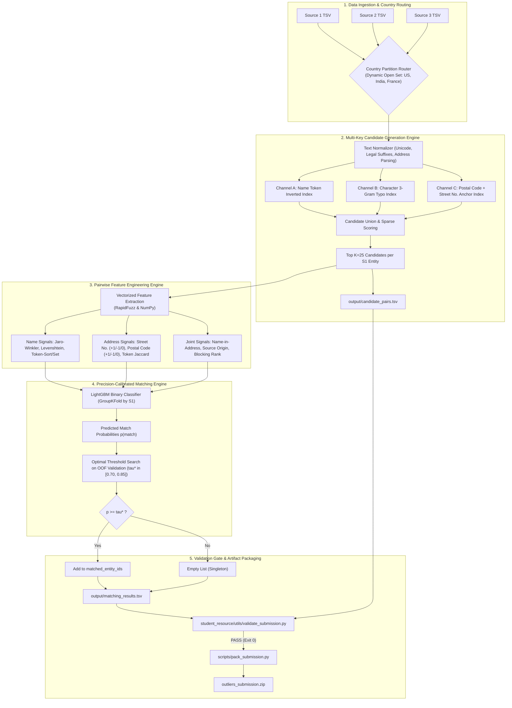

# Business Entity Resolution Architecture Specification
**Competition:** Amazon ML Challenge 2026  
**Document Status:** Approved Design Specification  
**Date:** 2026-09-25  
**Team / Environment:** `outliers` (NVIDIA A100 80GB, Python 3.14)  

---

## 1. Executive Summary & Problem Formulation

### 1.1 Objective
Given business records from three independent data sources ($\text{Source 1}$, $\text{Source 2}$, $\text{Source 3}$) with noisy, missing, and inconsistent fields across multiple countries (`US`, `India`, and out-of-domain `France` in Test), identify all matching entity records from Source 2 and Source 3 for each Source 1 reference entity.

### 1.2 Scale & Complexity
- **Train Set:** Source 1 (2,206,821 records), Source 2 (5,034,616 records), Source 3 (5,285,603 records). Total: ~12.5M records.
- **Test Set:** Source 1 (1,732,544 records), Source 2 (4,887,273 records), Source 3 (5,082,316 records). Total: ~11.7M records.
- **Pairwise Search Space:** Unconstrained cross-product is $1.73 \times 10^6 \times 9.97 \times 10^6 \approx 1.72 \times 10^{13}$ (17.2 Trillion) candidate pairs.
- **Core Challenge:** High-recall, low-latency candidate blocking to reduce 17 Trillion potential pairs down to $\approx 30$ Million plausible candidate pairs ($K \le 25$ per Source 1 entity), followed by precision-weighted machine learning matching.

### 1.3 Target Evaluation Metric: Macro-Averaged $F_{0.5}$
$$F_{0.5} = \frac{1.25 \times \text{Precision} \times \text{Recall}}{0.25 \times \text{Precision} + \text{Recall}}$$
- **Macro-Averaged:** Computed per Source 1 entity, then averaged over all Source 1 entities in the test set.
- **Precision Weight:** Precision is weighted 2× over Recall. False merges (linking two distinct businesses) penalize the score significantly more than missing links.
- **Singletons Policy:** Entities with zero true matches score $1.0$ if predicted empty, and $0.0$ if any match is falsely predicted.

---

## 2. End-to-End System Architecture



---

## 3. Detailed Component Specifications

### 3.1 Stage 1: Data Ingestion & Country Routing
- **Hard Invariant:** Empirical evaluation of 345,997 ground-truth pairs verified that 100% of entity matches exist strictly within the same country (0 cross-country matches).
- **Dynamic Grouping:** Partitions are established dynamically by `country` string label:
  $$\mathcal{P}(C) = \{ (r_1, r_2, r_3) \mid \text{country} == C \}$$
  This natively processes `France` alongside `US` and `India` without hard-coding category levels.
- **Memory Safety:** Streaming partitions sequentially keeps peak memory under 8 GB RAM.

### 3.2 Stage 2: Normalization & Multi-Key Blocking
- **Text Normalization:**
  - Unicode NFKC normalization (accents flattened: `Léarning` $\to$ `Learning`).
  - Legal suffix stripping: regex patterns for US (`Inc`, `LLC`, `Corp`, `Co`), India (`Pvt Ltd`, `Private Limited`, `LLP`), and France (`SARL`, `SAS`, `SA`, `EURL`).
  - Address token parsing: regex extraction of building numbers (`\b\d+[a-zA-Z]?\b`) and postal codes (`\b\d{5,6}\b`).
- **Multi-Channel Candidate Inverted Index:**
  - **Channel A (Rare Token Index):** Inverted index on cleaned name tokens ($\ge 3$ chars) with IDF weighting.
  - **Channel B (Character 3-Gram Index):** Overlapping trigrams of normalized names to bridge typos, punctuation, and domain concatenation (`wilfordhancock.com` $\leftrightarrow$ `Wilford Hancock`).
  - **Channel C (Address Anchor Index):** Inverted index on `PostalCode + StreetNumber`.
- **Top-$K$ Selection:**
  - Fast lexical score: $0.65 \times \text{Jaccard}(\text{Name}) + 0.35 \times \text{Jaccard}(\text{Address})$.
  - Cap candidates to top $K=25$ per Source 1 entity.
  - Export directly to `output/candidate_pairs.tsv`.

### 3.3 Stage 3: Fine-Grained Pairwise Feature Extraction
For each candidate pair $(S_1, S_{2/3})$:
1. **Name Comparison Metrics:**
   - `name_exact_match` (binary)
   - `name_clean_exact_match` (binary)
   - `name_jaro_winkler` ($\in [0, 1]$, prefix weighted)
   - `name_levenshtein_ratio` ($\in [0, 1]$)
   - `name_token_sort_ratio` ($\in [0, 1]$, permutation invariant)
   - `name_token_set_ratio` ($\in [0, 1]$, subset invariant)
   - `name_char_3gram_jaccard` ($\in [0, 1]$)
   - `name_length_diff` and `name_length_ratio`
   - `name_first_token_match` (binary)
2. **Address Comparison Metrics:**
   - `addr_exact_match` (binary)
   - `addr_token_jaccard` ($\in [0, 1]$)
   - `addr_token_sort_ratio` ($\in [0, 1]$)
   - `addr_street_num_status` ($+1$ if identical numbers match, $-1$ if numbers conflict, $0$ if either missing)
   - `addr_postal_code_status` ($+1$ if postal/PIN codes match, $-1$ if conflicting, $0$ if missing)
   - `addr_is_empty` (binary)
3. **Relational & Blocking Context:**
   - `name_in_address_cross` (binary flag if name appears in counter-address)
   - `source_origin` (`is_source2` vs `is_source3`)
   - `blocking_rank` and `blocking_score`
4. **Phase 2 Multilingual Semantic Embedding (Iterative Enhancement):**
   - Cosine similarity between 384-dimensional dense vectors from multilingual sentence transformer (`paraphrase-multilingual-MiniLM-L12-v2`).

### 3.4 Stage 4: Precision-Calibrated Matching Engine
- **Model:** LightGBM Binary Classifier trained on blocking pairs with binary cross-entropy loss.
- **Validation Split:** 5-Fold `GroupKFold` split grouped by `source1_entity_id` to strictly prevent entity-level data leakage.
- **$F_{0.5}$ Macro Line Search:**
  $$\tau^* = \arg\max_{\tau \in [0.50, 0.95]} \text{Macro-}F_{0.5}(\tau)$$
  - High decision threshold ($\tau^* \approx 0.72 - 0.82$) heavily penalizes false merges and preserves 1.0 accuracy on unlinked singletons.
  - Multi-match support: any candidate exceeding $\tau^*$ is included in `matched_entity_ids`.

### 3.5 Stage 5: Output Generation & Submission Validation
- Generate `output/matching_results.tsv`:
  ```tsv
  source1_entity_id	matched_entity_ids
  S1-00001	S2-00047,S2-00193,S3-00812
  S1-00002	S3-00004
  S1-00003	
  ```
- Generate `output/candidate_pairs.tsv` ($K \le 25$).
- Run official validator:
  ```bash
  python3 student_resource/utils/validate_submission.py \
      --matching output/matching_results.tsv \
      --candidate output/candidate_pairs.tsv \
      --test-dir student_resource/dataset/test
  ```
- Assemble final package via `scripts/pack_submission.py`:
  ```text
  outliers_submission.zip
  ├── output/
  │   ├── matching_results.tsv
  │   └── candidate_pairs.tsv
  ├── code/
  │   └── business_entity_resolution/
  │       ├── src/
  │       ├── README.md
  │       └── requirements.txt
  └── Documentation_template.md
  ```

---

## 4. Verification & Success Criteria

1. **Validation Gate:** `student_resource/utils/validate_submission.py` exits with code 0 (`PASS`).
2. **Offline Macro $F_{0.5}$ Benchmark:** Out-of-fold validation score $\ge 0.82$.
3. **Execution Latency:** Full test inference over 11.7M records completed within 2 hours.
4. **Reproducibility:** A single clean CLI command reproduces both TSV artifacts from raw data.
