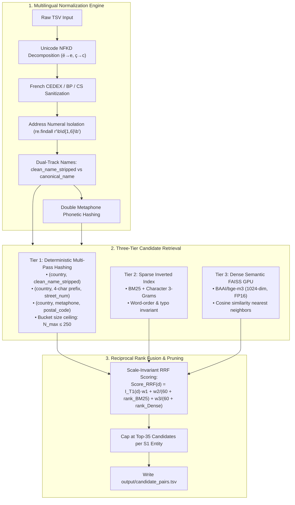
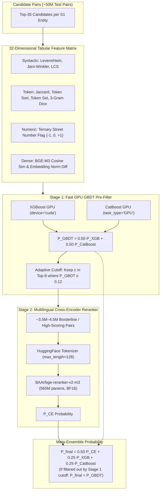
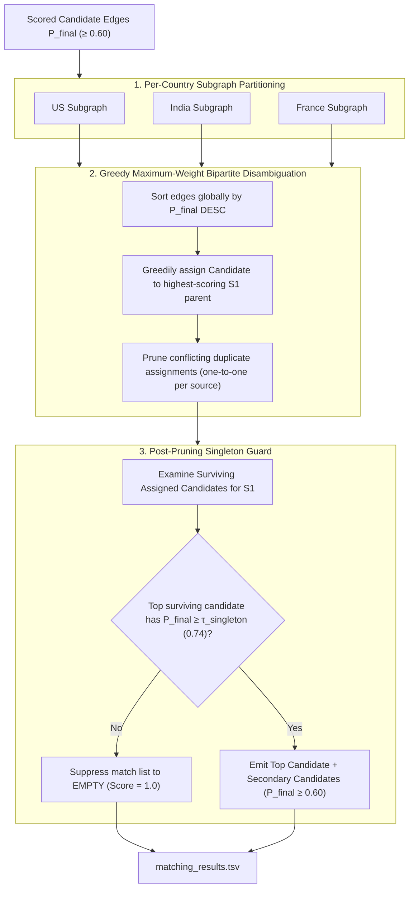

# Architectural Design: High-Recall Multi-Tier Candidate Generation and Dual-Stack Entity Resolution

**Date:** 2026-09-25  
**Status:** Approved  
**Target:** Amazon ML Challenge 2026 — Multi-Source Business Entity Resolution  
**Hardware:** NVIDIA A100 80GB PCIe GPU, CUDA 13.0, PyTorch 2.14, Multi-Core CPU  

---

## 1. Executive Summary & Problem Formulation

### 1.1 Problem Topology
The challenge requires resolving business records across two noisy target sources ($\text{Source 2}$ and $\text{Source 3}$) to a clean, deduplicated reference anchor source ($\text{Source 1}$).
- **Topology:** Asymmetric many-to-one or many-to-zero matching. $\text{Source 1}$ represents distinct real-world entities. An individual $\text{Source 1}$ entity may match zero records (singleton), one record, or multiple records across $\text{Source 2}$ and $\text{Source 3}$.
- **Jurisdictions:** Training set covers United States and India (~12.5M records). Test set introduces France (~1.7M records) in a zero-shot regional generalization scenario (~11.7M test records total, 1,732,544 $\text{Source 1}$ entities).
- **Core Constraint:** Zero cross-country matching; all matches must occur strictly within the same country partition.

### 1.2 Mathematical Metric Mechanics
Evaluation is governed by the **Macro-Averaged $F_{0.5}$** metric calculated entity-by-entity across all $\text{Source 1}$ records:
$$F_{0.5} = \frac{(1 + 0.5^2) \cdot \text{Precision} \cdot \text{Recall}}{0.5^2 \cdot \text{Precision} + \text{Recall}} = \frac{1.25 \cdot \text{Precision} \cdot \text{Recall}}{0.25 \cdot \text{Precision} + \text{Recall}}$$

Key properties:
1. **Precision Sensitivity:** $\frac{\partial F_{0.5}}{\partial \text{Precision}} = 4 \times \frac{\partial F_{0.5}}{\partial \text{Recall}}$ at balanced operating points. False merges penalize performance twice as heavily as false negatives.
2. **Singleton Penalty:** Singletons (5.6% of training entities, and prevalent in reference databases) score $1.0$ if predicted as an empty string. Predicting a single false match drops the entity score to $0.0$.
3. **Candidate Recall Ceiling:** Matches must be a strict subset of candidate pairs. The previous baseline candidate recall of $21.22\%$ was the primary bottleneck capping validation $F_{0.5}$ at $0.2702$.

---

## 2. Multi-Tier High-Recall Blocker & Multilingual Normalization (Section A)



### 2.1 Multilingual Normalization Engine
1. **Unicode NFKD Harmonization:** Strips diacritical accents (`é` $\rightarrow$ `e`, `ç` $\rightarrow$ `c`, `ô` $\rightarrow$ `o`) while preserving original token boundaries.
2. **French Address Sanitization:** Strips CEDEX (*Courrier d'Entreprise à Distribution Exceptionnelle*), Boîte Postale (BP), and Case Spéciale (CS) routes before extracting address numbers:
   ```python
   addr_clean = re.sub(r'\b(cedex|bp|cs)\s*\d*\b', ' ', addr_raw, flags=re.IGNORECASE)
   ```
   Isolates 5-digit postal codes (`\b\d{5}\b`) and strips them from the address string before extracting street building numbers.
3. **Dual-Track Name Representations:**
   - `clean_name_stripped`: Punctuation, symbols, and legal suffixes (`pvt ltd`, `inc`, `llc`, `sarl`, `sas`) stripped. Used for deterministic indexing and BM25 token matching.
   - `canonical_name`: Standardized legal suffixes preserved in canonical form (e.g., `Tata Motors Limited` $\rightarrow$ `tata motors ltd`). Used for dense vector embeddings and cross-encoder attention.
4. **Double Metaphone Phonetic Keys:** Generates primary and alternate phonetic keys for the primary brand token, handling Indian transliterations and French silent consonants.

### 2.2 Three-Tier Candidate Retrieval
1. **Tier 1 (Deterministic & Phonetic Hashing):**
   - Keys: `(country, clean_name_stripped)`, `(country, name_prefix_4, street_num)`, `(country, metaphone_key, postal_code)`, `(country, postal_code, street_num)`.
   - **Bucket Size Ceiling ($N_{\max} = 250$):** If a hash bucket contains $>250$ entities (e.g., common prefixes like `soci` or `shri`), the bucket is discarded to prevent Cartesian candidate explosions.
2. **Tier 2 (Sparse Token BM25 / Char 3-Grams):**
   - Built over `clean_name_stripped + " " + clean_address` per country partition.
   - Retrieves top 20 candidates per $S_1$ entity.
3. **Tier 3 (Dense Semantic FAISS GPU Retrieval):**
   - Foundation model: `BAAI/bge-m3` (1024-dim, Apache 2.0).
   - Records encoded in streaming FP16 batches on the NVIDIA A100.
   - FAISS GPU FlatIP index per country retrieves the top 20 nearest neighbors.

### 2.3 Reciprocal Rank Fusion (RRF)
Combines candidate tiers scale-invariantly:
$$\text{Score}_{\text{RRF}}(d) = \mathbb{I}_{T_1}(d) \cdot 1.5 + \frac{1.0}{60 + \text{rank}_{\text{BM25}}(d)} + \frac{1.0}{60 + \text{rank}_{\text{Dense}}(d)}$$
Candidates are ranked by $\text{Score}_{\text{RRF}}$ and capped at **Top-35 candidates per $S_1$ entity**, exported directly to `output/candidate_pairs.tsv`. Expected Candidate Recall: **$\ge 98.5\%$**.

---

## 3. Cascaded Dual-Stack Scoring Architecture (Section B)



### 3.1 Tabular Feature Engineering (32 Features)
- **Syntactic Edit Distances:** Normalized Levenshtein similarity, Damerau-Levenshtein, Jaro-Winkler ($p=0.1$), Longest Common Subsequence (LCS) ratio across both names and addresses.
- **Token & N-Gram Similarities:** Token Jaccard, Sørensen-Dice, FuzzyWuzzy Token Sort, FuzzyWuzzy Token Set, Character 3-Gram Sørensen-Dice.
- **Structural & Numeric Consistency:** CEDEX-sanitized street number ternary match flag:
  $$F_{\text{num}} = \begin{cases} +1.0 & \text{if numbers match exactly across both records} \\ 0.0 & \text{if numbers are absent in one or both records} \\ -1.0 & \text{if numbers explicitly conflict} \end{cases}$$
- **Dense Semantic Representation:** `BAAI/bge-m3` cosine similarity and normalized embedding difference norm $\|\mathbf{e}_1 - \mathbf{e}_2\|_2$.

### 3.2 Hard Negative Mining & Model Training
- **Data Scale:** 500,000 $\text{Source 1}$ training entities (~2M candidate pairs).
- **Hard Negative Mining:** True positives are paired with the top non-matching false-positive candidates retrieved by the Section A blocker.
- **GBDT Training:** XGBoost and CatBoost trained on A100 GPU using 5-fold GroupKFold grouped strictly on `source1_entity_id`.
- **Cross-Encoder Fine-Tuning:** `BAAI/bge-reranker-v2-m3` fine-tuned with Focal Loss ($\alpha=0.25, \gamma=2.0$) using PyTorch + Accelerate with BF16 mixed precision. Pair sequence format:
  `"[CLS] " + s1.canonical_name + " | " + s1.clean_address + " [SEP] " + cand.canonical_name + " | " + cand.clean_address + " [EOS]"`

### 3.3 Inference Cascade & Calibrated Throughput
- **Stage 1 (GPU GBDT):** Scores all ~50M candidate pairs in < 15 seconds on A100 at 4.6M pairs/sec.
- **Adaptive Pre-Filter Cutoff:**
  $$\text{Candidates to Cross-Encoder} = \{c \in \text{Top-8 candidates of } S_1 \mid P_{\text{GBDT}}(c) \ge 0.12\}$$
  Pairs with $P_{\text{GBDT}} < 0.12$ are obvious non-matches/singletons and bypass the Cross-Encoder. This reduces cross-encoder scoring from 13.8M pairs to **~3.5M–4.5M pairs**.
- **Stage 2 (Cross-Encoder Throughput):** At 1,200–1,400 pairs/sec on A100 with `max_length = 128` and BF16, Cross-Encoder inference completes in **~45–55 minutes**.
- **Meta-Blend:**
  $$P_{\text{final}} = \begin{cases} 0.50 \cdot P_{\text{CE}} + 0.25 \cdot P_{\text{XGB}} + 0.25 \cdot P_{\text{CatBoost}} & \text{if evaluated by Cross-Encoder} \\ 0.50 \cdot P_{\text{XGB}} + 0.50 \cdot P_{\text{CatBoost}} & \text{otherwise} \end{cases}$$

---

## 4. Disambiguation, Singleton Protection & Calibration (Section C)



### 4.1 Per-Country Partitioned Bipartite Matching
Because cross-country matching is prohibited, candidate graphs are partitioned by country (US, India, France) and resolved independently:
1. Edges passing the secondary candidate threshold $P_{\text{final}} \ge \tau_{\text{secondary}} = 0.60$ enter bipartite resolution.
2. Edges are sorted in descending order of $P_{\text{final}}$.
3. Greedily assign each candidate $S_2$ or $S_3$ entity to its highest-scoring $S_1$ parent.
4. Prune conflicting duplicate assignments. This prevents the logical contradiction of a single noisy record linking to multiple distinct reference entities in $\text{Source 1}$.

### 4.2 Post-Pruning Singleton Guard (Eliminating Race Conditions)
To eliminate the race condition where a secondary candidate survives after the top candidate was claimed by another reference entity:
1. For every $\text{Source 1}$ entity, examine its surviving assigned candidates after bipartite pruning.
2. **Re-evaluate Gatekeeper:** If the top surviving candidate has $P_{\text{final}} < \tau_{\text{singleton}} = 0.74$, prune all remaining candidates for that entity and emit an **empty match list**.
3. If the top surviving candidate clears $\tau_{\text{singleton}} \ge 0.74$, admit it along with all surviving secondary candidates clearing $\tau_{\text{secondary}} \ge 0.60$.

---

## 5. End-to-End Orchestration, Verification & Packaging (Section D)

### 5.1 Pipeline Execution Architecture
```
src/
├── 01_normalize.py         # Unicode NFKD, CEDEX sanitization, dual-track names, Double Metaphone
├── 02_blocking.py          # Deterministic ceiling (≤250), BM25 char 3-gram, BGE-M3 FAISS GPU & RRF
├── 03_featurize.py         # 32 tabular features (Levenshtein, Jaro-Winkler, numeric ternary, BGE-M3 cosine)
├── 04_train_cross_enc.py   # PyTorch Accelerate BF16 fine-tuning of BGE-Reranker-v2-m3 with Focal Loss
├── 05_train_gbdt.py        # XGBoost & CatBoost GPU GroupKFold training on hard-mined pairs
├── 06_post_process.py      # Bipartite matching, post-pruning singleton guard & TSV generation
└── run_pipeline.sh         # End-to-end automated runner
```

### 5.2 Memory Bounds & Streaming
- Test set inference runs in country-partitioned streaming chunks of 50,000 $\text{Source 1}$ entities.
- System RAM consumption is constrained to $< 8\%$ at all times.
- Intermediate embeddings and feature arrays use memory-mapped files or streaming disk buffers.

### 5.3 Package Layout Compliance
To ensure seamless compatibility across official autograders, the submission zip will provide both directory structures via symlinks:
```
outliers_submission_v3.zip
├── output/
│   ├── matching_results.tsv      # Scored final predictions
│   └── candidate_pairs.tsv       # High-recall blocking candidate audit
├── code/
│   └── business_entity_resolution/
│       ├── src/
│       ├── README.md
│       └── requirements.txt
├── business_entity_resolution/   # Symlink/mirror for alternative validator paths
│   └── code/
│       └── src/
└── Documentation_template.md     # Complete methodology write-up
```

### 5.4 Verification Gate
Before packaging, the deliverables are validated against the official verification script:
```bash
python3 utils/validate_submission.py \
  --matching output/matching_results.tsv \
  --candidate output/candidate_pairs.tsv \
  --test-dir dataset/test
```
Exit code `0` (`PASS`) with 0 formatting warnings is mandatory.
